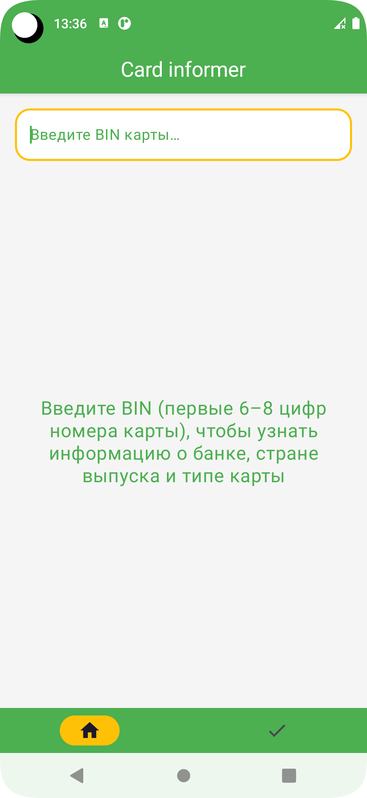
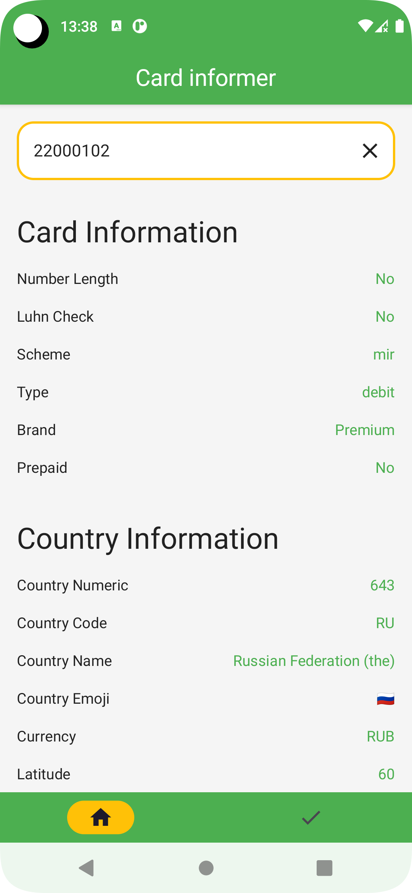
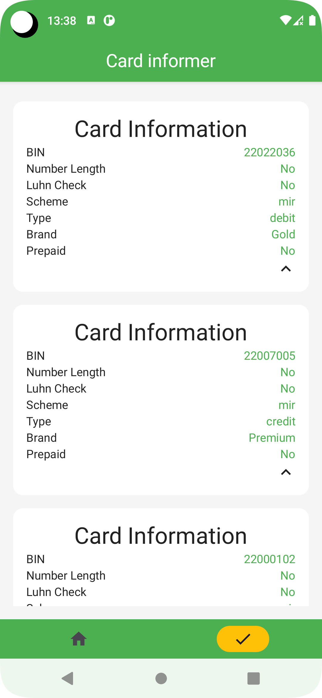

# Card Informer

**Card Informer** — то Android-приложение, которое определяет данные банка по BIN карты. Пользователи могут вводить BIN, а приложение с использованием API BINLIST.NET предоставляет подробную информацию о банке, выпустившем карту.

  

## Функциональность
- 🔍 **Поиск по BIN ** —  введите BIN карты для получения информации о банке.
- 🏦 **Детальная информация** — просматривайте сведения о банке, включая название, страну и другие данные.
- 📚 **История запросов** — сохраняйте историю выполненных запросов для быстрого доступа к ранее проверенной информации.

## API
Приложение использует [BINLIST.NET](https://binlist.net/) для получения данных о картах и банках, что позволяет пользователям быстро получать актуальную информацию.

## Используемые технологии и библиотеки
- **Jetpack Compose**: для создания современного и удобного пользовательского интерфейса.
- **Kotlin Coroutines**: для асинхронных операций.
- **Navigation Component**: для управления навигацией.
- **Room**: для локального хранения данных.
- **Hilt**: для внедрения зависимостей.
- **Retrofit и Gson**: для работы с API и парсинга JSON.
